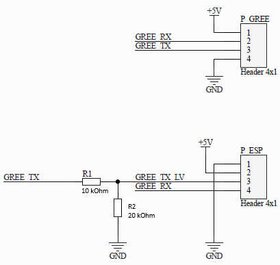

# ESPHOME component to support Gree/Sinclair AC units
This repository adds support for ESP32-based WiFi modules to interface with Gree/Sinclair AC units.
This generally replaces stock WiFi module, sometimes giving a little more advanced features for swing control than stock application or remote.

**USE AT YOUR OWN RISK!**

** This fork is optimized for Gree GWH12RB-K3DNA3G/I (Viola) **

Tested with Gree Viola, every function and mode works correctly.

It is based on https://github.com/piotrva/esphome_gree_ac.git

ESPHome interface/binding based on:
* https://github.com/DomiStyle/esphome-panasonic-ac

**USAGE**
* Use at your own risk!
* See: https://github.com/nedkoff/esphome_gree_ac/tree/main/examples
* Create configuration file: `ac-sinclair-main.yaml`
* Configure youe ESP `board`, `uart`, optionally `status_led`, check `wifi` settings (secrets)
* Create configuration(s) for your device(s): `ac-living-room.yaml`, `ac-bedroom.yaml`
* Configure deviceid and devicename, use proper `api` and `ota` keys
* Upload initial configuration to your ESP board using USB connection
* Disconnect completely power from your AC system, follow all safety procedures, desolder original WiFI unit
* Prepare a DIY adapter to connect ESP board to the AC unit, see table and representative schematic below
* Reconnect power to your AC system.
* Enjoy!

Generally stock WiFi module outputs UART with 3.3V signal levels and the AC unit outputs UART with 5V signal levels therefore a simple voltage divider on UART from AC unit towards ESP is usually suitable, considering very slow baudrate.
On some stock WiFi PCBs AC unit connector pins are marked on silkscreen.

| AC unit pin | Function | ESP connection        |
| ----------- | -------- | --------------------- |
| 1           | +5V      | VIN / 5V              |
| 2           | RX       | UART TX               |
| 3           | TX       | UART RX (via divider) |
| 4           | GND      | GND                   |

Changes made in this fork:
* Removed horizontal swing (this model does't have motorized horizontal flaps )
* Removed unsupported verical swing modes (it have only "Full" and "Off" )
* Fixed fan modes (different values and less modes)
* Fixed actual temperature shown in Home Assistant
* Fixed the need to resubmit a command
* Compatible with Esphome 2026.1 and framework: esp-idf

